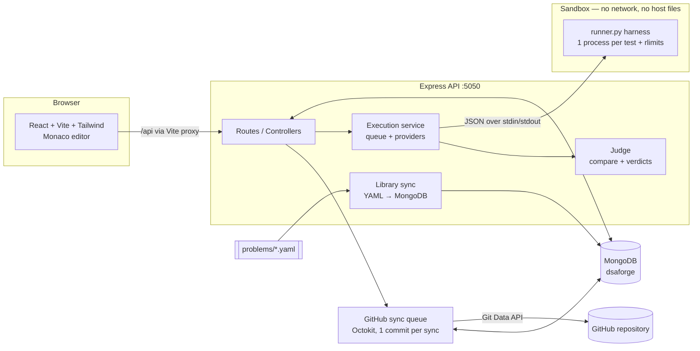
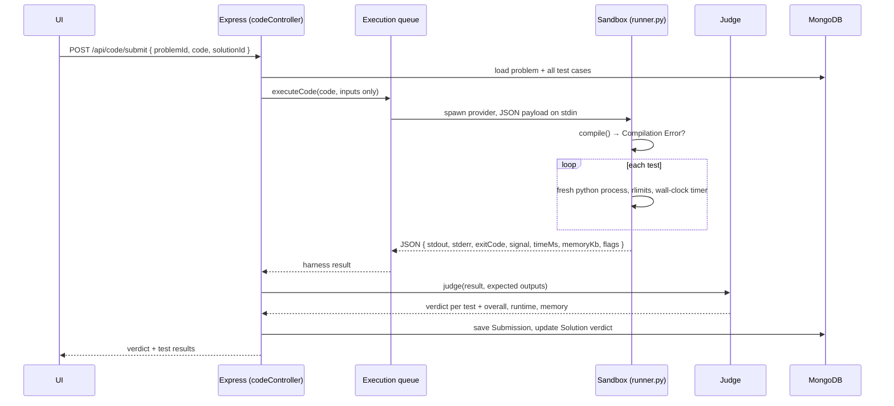

# DSAForge Architecture

## 1. Overview



- **Single user.** There is no authentication and no `userId` on models.
- **The library mirrors Striver's A2Z sheet.** `src/data/a2z/sheet.json` indexes all 18 steps, their sub-steps and 474 problems (title, difficulty, practice links); `steps.js` gives each step a short name and `mapping.json` links older DSAForge slugs to sheet entries. Regenerate the index with `node scripts/refresh-a2z-index.js`. The structure comes from the MIT-licensed [striver-a2z-sheet](https://github.com/anishmusician/striver-a2z-sheet) index; every statement, test case and starter in DSAForge is written from scratch.
- **Problem content as data.** Problems live in versioned YAML files, one per step, each tied to a sheet entry by `sheetId`, and are upserted by `sheetId` on startup, so problem `_id`s (and the solutions that reference them) are stable. An entry is one of three kinds: **ready** (454 — solvable, with tests and a reference solution), **reference** (20 — theory items ticked off with "Mark as done"), or **placeholder** (a sheet entry whose content is not written; it still appears in the library and the counts, but cannot be run). `npm run missing` lists placeholders.
- **Language-agnostic judging.** Programs read stdin and write stdout, and the judge compares normalized lines. JavaScript, C++ and Java can be added later by adding a runner in `sandbox/<language>/` and enabling the language in `config/languages.js`.
- **Separation of concerns.** The sandbox only runs code and reports raw results. The Node judge owns expected outputs and verdicts.

## 2. Folder structure

```
progit/
├── README.md
├── docs/
│   ├── ARCHITECTURE.md
│   └── PROBLEM_FORMAT.md
├── sandbox/
│   ├── python/
│   │   ├── runner.py          # harness: runs each test with rlimits, returns JSON
│   │   └── Dockerfile         # image for the docker provider
│   └── wsl/
│       ├── sandbox.sh         # stage 1: user/mount/net/pid/ipc/uts namespaces + timeout
│       └── inner.sh           # stage 2: private /tmp, hide host dirs, drop to nobody
├── backend/
│   ├── .env.example
│   ├── scripts/
│   │   ├── seed.js            # sync YAML library → MongoDB
│   │   ├── test-sandbox.js    # sandbox correctness + isolation checks
│   │   ├── test-github-sync.js# end-to-end GitHub sync tests (mock GitHub API)
│   │   ├── lib/mockGitHub.js  # in-memory GitHub REST/Git Data API for tests
│   │   └── verify-problems.js # validate data, run reference solutions (local or --sandbox)
│   └── src/
│       ├── server.js          # connect DB, sync library, listen
│       ├── app.js             # express app, routes, error handling
│       ├── config/            # env, db, languages
│       ├── data/
│       │   ├── a2z/           # sheet.json (18 steps, 474 entries), steps.js, mapping.json
│       │   ├── sections.js    # the 18 steps, derived from the sheet index
│       │   ├── loadProblems.js# YAML loader + validation + placeholders
│       │   └── problems/      # 01-learn-the-basics.yaml … 18-strings-advanced.yaml
│       ├── models/            # Problem, Solution, Submission, GitHubSettings, GitHubSync
│       ├── routes/            # problems, solutions, code, submissions, dashboard, github
│       ├── controllers/       # request handling per resource
│       ├── services/
│       │   ├── execution/     # provider selection, queue, spawnSandbox, providers/
│       │   ├── judge/         # compare.js, judge.js, verdicts.js
│       │   ├── github/        # client, connectionService, oauthService, repoFiles, gitCommit, syncService
│       │   ├── librarySync.js
│       │   ├── progressService.js
│       │   └── dashboardService.js
│       ├── middleware/        # errorHandler, validateObjectId
│       └── utils/             # httpError, text, dates
└── frontend/
    ├── index.html
    ├── vite.config.js         # React + Tailwind plugins, /api proxy
    └── src/
        ├── main.jsx, App.jsx  # providers + routes (editor pages lazy-loaded)
        ├── index.css          # Tailwind + light/dark design tokens
        ├── api/               # axios client + endpoint functions
        ├── context/           # SettingsContext (theme, editor prefs), ToastContext
        ├── hooks/             # useApi, useDebounce, useWorkspace
        ├── lib/monaco.js      # local Monaco, themes, Python completions/formatter
        ├── utils/             # constants, format, storage, tidyPython
        ├── components/
        │   ├── ui/            # Button, Card, Badge, Modal, Field, Tabs, States, …
        │   ├── layout/        # AppLayout, Sidebar
        │   ├── dashboard/     # StatCard, SectionProgressList, DifficultyProgress, …
        │   ├── problems/      # ProblemFilters, ProblemSectionGroup, RepeatableList
        │   ├── progress/      # ActivityHeatmap
        │   └── workspace/     # CodeEditor, EditorToolbar, ConsolePanel, ResultView,
        │                      # ProblemDescription, ApproachesPanel, ApproachModal,
        │                      # CompareModal, ComplexityTable, SubmissionsPanel
        └── pages/             # Dashboard, ProblemLibrary, ProblemWorkspace, MySolutions,
                               # Progress, GitHub, Settings, CustomProblem, NotFound
```

## 3. MongoDB schemas

### Problem
| Field | Type | Notes |
| --- | --- | --- |
| problemNumber | Number | Library: 1…474 in sheet order. Custom: 1001+ |
| sheetId | String | the A2Z sheet entry this problem is (null for custom problems); unique |
| contentStatus | String | `ready` (solvable) or `placeholder` (on the sheet, not written yet) |
| title, slug | String | slug is unique; sheet problems use the sheet's slug |
| section, sectionOrder, sectionFullTitle | String/Number | the step: short name, step number, full sheet title |
| subStepNo, subtopic | Number/String | the sub-step within the step |
| orderInSection | Number | position within the step |
| practiceLinks | { leetcode, gfg, code360, article, youtube } | from the sheet |
| topic, subtopic, difficulty, tags | String / [String] | difficulty: Easy, Medium or Hard |
| statement, inputFormat, outputFormat, explanation | String | Markdown |
| constraints, hints | [String] | |
| examples | [{ input, output, explanation }] | |
| testCases | [{ input, expectedOutput, isHidden }] | hidden cases are never sent to the UI (except when editing a custom problem) |
| starterCode | { python } | |
| supportedLanguages | [String] | `["python"]` |
| sourceUrl, isCustom | String / Boolean | |
| createdAt, updatedAt | Date | timestamps |

### Solution (one saved approach)
| Field | Type | Notes |
| --- | --- | --- |
| problemId | ObjectId → Problem | |
| title | String | approach name, e.g. "Hash Map" |
| slug | String | from title; **unique per problem** (so approaches never overwrite each other); future GitHub file name |
| approach | String | Brute Force, Better, Optimal or Other |
| code, language | String | |
| timeComplexity, spaceComplexity, explanation | String | |
| verdict | String | last submission verdict, or `Not Submitted` (reset when code changes) |
| runtime (ms), memory (KB) | Number | |
| githubPath, githubCommitUrl | String | where the file lives, and the last commit that changed it |
| githubStatus | String | not-synced, pending, syncing, synced, outdated or failed. A pre-save hook sets `outdated` when synced fields change |
| githubSyncError, githubSyncedAt | String / Date | |
| isDraft | Boolean | true until an accepted submission |
| lastSubmittedAt, createdAt, updatedAt | Date | |

### Submission
| Field | Type | Notes |
| --- | --- | --- |
| problemId, solutionId | ObjectId | solutionId is null for unsaved code |
| code, language, verdict | String | |
| runtime, memory, passedCount, totalCount | Number | |
| compileError | String | |
| testResults | [{ index, verdict, passed, isHidden, timeMs, memoryKb, input?, expectedOutput?, actualOutput?, error? }] | details kept only for visible tests and the first failing test |
| submittedAt | Date | |

### GitHubSettings (single document, `key: "default"`)
| Field | Type | Notes |
| --- | --- | --- |
| oauthToken | String | `select: false`, set only by the OAuth flow, never returned by the API |
| user | { login, name, avatarUrl, htmlUrl } | cached from `GET /user` |
| repository | { fullName, owner, name, htmlUrl, isPrivate, defaultBranch } | |
| branch, basePath | String | basePath is an optional folder inside the repo |
| autoSync | Boolean | default true |

### GitHubSync (one record per approach per sync attempt)
| Field | Type | Notes |
| --- | --- | --- |
| solutionId, problemId | ObjectId | |
| problemTitle, solutionTitle | String | kept so history still reads well after deletes |
| action | String | `upsert` or `delete` |
| repository, branch, filePath | String | |
| commitSha, commitUrl, commitMessage, changed | String / Boolean | `changed: false` means already up to date, with no commit |
| syncStatus | String | pending, syncing, synced or failed |
| error, syncedAt | String / Date | |

**Derived, not stored:** problem status (`solved` means it has an accepted submission, `attempted` means it has any activity) and streaks (consecutive local-time days with an accepted submission).

## 4. API design

| Method | Route | Purpose |
| --- | --- | --- |
| GET | `/api/health` | Server, database and languages status |
| GET | `/api/problems?search=&section=&topic=&difficulty=&status=` | List with status and solution counts. Search matches every word against title, slug, topic, subtopic, section, tags and `#number` |
| GET | `/api/problems/meta` | Filter options |
| GET | `/api/problems/:slug` | Full problem with visible tests and `hiddenTestCount` |
| POST | `/api/problems` | Create a custom problem |
| PUT | `/api/problems/:id` | Update a custom problem (library problems return 403) |
| DELETE | `/api/problems/:id` | Delete a custom problem with its solutions and submissions |
| GET | `/api/solutions?search=&verdict=` | All approaches, without code (My Solutions) |
| GET | `/api/solutions/:problemId` | Approaches for one problem, with code |
| POST | `/api/solutions` | Create an approach. Returns 409 if the name exists. An optional `submissionId` attaches a just-submitted verdict |
| PUT | `/api/solutions/:id` | Update this approach only |
| DELETE | `/api/solutions/:id` | Delete an approach (submissions are kept) |
| POST | `/api/code/run` | `{ problemId, code, language, customInput? }` → visible tests plus custom input. Not saved |
| POST | `/api/code/submit` | `{ problemId, code, language, solutionId? }` → all tests. Stores a Submission and updates the approach |
| GET | `/api/code/info` | Sandbox provider and limits |
| POST | `/api/code/health` | Run a tiny program in the sandbox |
| GET | `/api/submissions?problemId=&limit=` | Submission history |
| GET | `/api/submissions/:id` | Submission with code and test results |
| GET | `/api/dashboard/stats` | Totals, solved count, streaks, multi-approach count |
| GET | `/api/dashboard/progress` | Per section, per difficulty, and daily activity |
| GET | `/api/dashboard/recent` | Recent submissions and solutions, continue solving, multi-approach problems |
| GET | `/api/github/status?refresh=` | Connection (method and user, never the token), repository, branch, folder, auto-sync, per-status counts |
| GET | `/api/github/repositories` | Repositories the token can access, with `canPush` |
| POST | `/api/github/repositories` | `{ name, isPrivate }` → create a repository (auto-initialized) |
| POST | `/api/github/select-repository` | `{ fullName, branch?, basePath? }`. Checks write access. Changing the location resets sync state |
| PUT | `/api/github/settings` | `{ autoSync?, branch?, basePath? }` |
| POST | `/api/github/sync/:solutionId` | Manual sync or retry of one accepted approach (202) |
| POST | `/api/github/sync-all` | Queue every accepted approach that is not synced, outdated or failed (202) |
| GET | `/api/github/syncs?limit=` | Sync history |
| POST | `/api/github/disconnect` | Forget the OAuth token and cached user |
| GET | `/api/github/oauth/start` | Redirect to GitHub authorize with a one-time `state` |
| GET | `/api/github/oauth/callback` | Exchange the code, store the token server-side, redirect to `/github` |

Errors are always `{ message }` with a meaningful status: 400 validation (and GitHub permission/not-found problems
explained in plain words), 403 read-only, 404, 409 duplicate or GitHub not ready, 503 sandbox unavailable
(`code: "SANDBOX_UNAVAILABLE"`).

## 5. How Python execution works



**Per test (inside the sandbox):** a new `python3 -I` process runs with these limits:
- `RLIMIT_CPU`: time limit, raising **TLE**
- `RLIMIT_AS`: 256 MB, raising `MemoryError` and **MLE**
- `RLIMIT_FSIZE` on the stdout file: **Output Limit Exceeded**
- `RLIMIT_NPROC` (32) and `RLIMIT_NOFILE` (64)
- a 64 MB stack, so deep recursion works

A wall-clock timer kills the process group if code sleeps or blocks. Execution stops after the first TLE.

**Namespace provider (WSL):**
1. `unshare --user --map-root-user --mount --net --pid --ipc --uts --fork --kill-child` runs under `timeout -s KILL`.
2. `inner.sh` mounts a `noexec` tmpfs on `/tmp` and copies the harness into it.
3. It then mounts empty tmpfs over `/mnt` (Windows drives, including this project's `.env`), `/home`, `/root`, `/run` (the WSL interop socket), `/opt`, `/srv`, `/media`, `/snap`, `/var/tmp`, `/var/log` and `/dev/shm`.
4. It enters a nested user namespace with no uid mapping, so code runs as `nobody` with no capabilities and every mount above is locked.

`npm run test:sandbox` verifies no network access, no host files, TLE, MLE and runtime/compile errors.

**Docker provider:** `docker run --rm -i --network none --read-only --tmpfs /tmp:noexec --memory --pids-limit 64 --cpus 1 --cap-drop ALL --security-opt no-new-privileges --user 65534`, then `docker kill` on timeout.

**Judge:** stdout is compared line by line. Whitespace inside lines is collapsed and trailing blank lines are ignored.
Verdict priority per test: TLE, then MLE, then OLE, then Runtime Error, then Accepted or Wrong Answer.
The overall verdict is the first failing test's verdict. Runtime and memory are the maximum across tests.

**Concurrency:** at most `EXECUTION_MAX_CONCURRENT` (2) sandbox runs at a time. Extra requests wait in a queue.

## 6. GitHub sync

**Code:** `backend/src/services/github/`
- `client.js`: Octokit and token resolution (OAuth token first, then `GITHUB_TOKEN`), with readable errors
- `connectionService.js`: status, repositories, selection and settings
- `oauthService.js`: the OAuth flow with one-time state
- `repoFiles.js`: paths and file rendering
- `gitCommit.js`: atomic multi-file commits
- `syncService.js`: queue, triggers and recovery

**Triggers:**
- An accepted submit on a saved approach.
- Saving an approach with a just-accepted submission.
- Editing the details of an accepted approach.
- Deleting an approach, or deleting a custom problem (removes files).
- Manual **Sync** or **Retry**, and **Sync all**.

Automatic triggers only fire when auto-sync is on and a repository is selected. Only **Accepted** approaches are synced.
Failed or unsubmitted code stays in MongoDB as a draft.

**One commit per sync**, via the Git Data API rather than one Contents API call per file:
1. Resolve the branch head. For an empty repository, create an initial README commit on the default branch; for a missing branch, create it from the default branch.
2. Read the recursive tree and compute each generated file's git blob sha locally. Unchanged files are skipped, and **if nothing changed, no commit is created**.
3. `createTree` (with `base_tree`) writes the changed files and deletes stale ones (renamed approaches, removed approaches, emptied problem folders).
4. `createCommit`, then `updateRef` with `force: false`. If someone pushed in between, the whole commit is rebuilt on the new head (up to 3 attempts).

**Files per sync:** the approach file(s), `problem.md`, `test_cases.txt`, the problem `README.md` (listing every approach
already on GitHub) and the root `README.md` (every synced problem grouped by section).
Paths: `<basePath>/<NN>-<Section>/<Problem-Title>/<approach-slug>.py`.

**Commit messages:**
- `Add Two Sum - Hash Map solution` when the file is new.
- `Update …` when the file already exists.
- `Remove …` when an approach is deleted.
- `Sync N solutions from DSAForge` for batch syncs.

**Concurrency and state:**
- Sync jobs run one at a time, so commits never race each other.
- Approaches move through `pending`, then `syncing`, then `synced` or `failed`.
- If an approach is edited while its sync is running, a content hash comparison marks it `outdated` instead of `synced`.
- On server start, interrupted `pending` or `syncing` jobs are marked `failed` so they can be retried.
- Changing the repository, branch or folder resets every approach to `not-synced`.

**Tests:** `npm run test:github` runs the real Express app on a throwaway database against `scripts/lib/mockGitHub.js`,
an in-memory Git Data API with fast-forward checks and failure injection. It covers:
- add, second approach, update, no-op re-sync, and outdated-until-accepted
- rename, delete, and 500/401 failure with retry
- auto-sync off, and concurrent submits
- empty repository with a new branch and base folder
- the OAuth flow

## 7. Checking the problem library

| Command | What it proves |
| --- | --- |
| `npm run verify:problems` | Every problem's data is valid, and its reference solution reproduces every example and test with the local Python |
| `npm run verify:problems -- --sandbox` | The same, but through the real sandbox and judge (the Python version and limits your submissions face) |
| `npm run verify:problems -- --section graphs` | One step only |
| `npm run missing` | Sheet entries still without content |

Problem authors cross-check each expected output with a second, independent implementation
(brute force, a different algorithm, or a library function), so tests are not simply "whatever
the reference printed".

## 8. Frontend workspace behavior

- The approach selector switches between saved approaches and a "New approach (unsaved)" buffer.
- Unsaved edits are kept as local drafts per problem and approach, so navigating away never loses code.
- **Save** updates the open approach, or asks for details (name, type, complexities, explanation) to create a new one.
- **Submit** on a saved approach stores the code and verdict on it. Submitting unsaved code offers "Save as approach", which carries the verdict along.
- Shortcuts: `Ctrl+Enter` run, `Ctrl+Shift+Enter` submit, `Ctrl+S` save, `Shift+Alt+F` format.

## 9. Local setup commands

```bash
cd backend  && npm install && cp .env.example .env && npm run test:sandbox && npm run dev
cd frontend && npm install && npm run dev
```

MongoDB defaults to `mongodb://127.0.0.1:27017/dsaforge`. The problem library syncs on server start.
